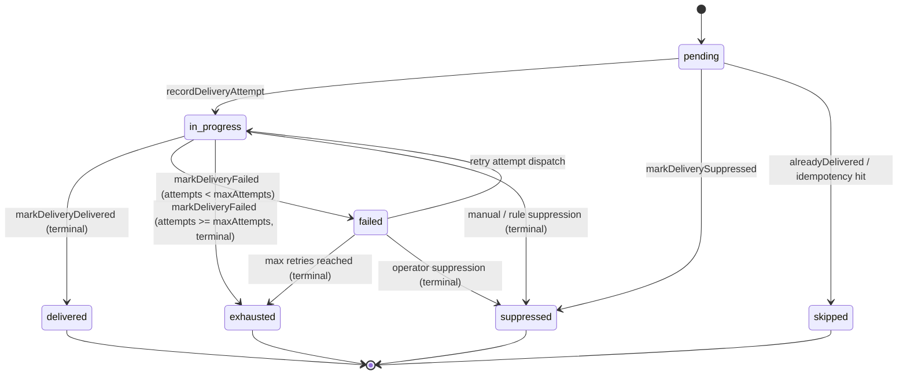

# Notification Delivery Identity, Database Uniqueness & Lifecycle Rules (#306)

## Overview

Stellar Alerts delivers notifications across multiple channels (Webhooks, Telegram, Email, Push, WhatsApp, Slack, Discord). To guarantee exactly-once delivery semantics and prevent duplicate alerts or infinite retry loops across worker restarts and concurrent dispatches, this feature implements:

1. **Logical Delivery Identity**: Encapsulated by `NotificationDelivery`, representing the canonical delivery of a specific payment alert across a specific channel and destination.
2. **Database Uniqueness Constraints**:
   - `NotificationDelivery.deliveryKey` (`@unique`): SHA-256 hash of `paymentId:channel:destination`.
   - `NotificationDelivery (paymentId, channel, destination)` (`@@unique`): Composite uniqueness preventing duplicate delivery entities.
   - `NotificationDeliveryAttempt (deliveryKey, attempt)` (`@@unique`): Composite uniqueness preventing double-counting or concurrent insertion of the same attempt sequence.
3. **Formal Lifecycle State Machine**:
   - Non-Terminal States: `pending`, `in_progress`, `failed` (retryable).
   - Terminal States: `delivered`, `exhausted`, `suppressed`, `skipped`.
   - Once a delivery transitions into a terminal state, subsequent attempts are strictly disallowed at both application and database levels.

---

## Data Model



### Schema Definitions

```prisma
model NotificationDelivery {
  id              String                       @id @default(cuid())
  deliveryKey     String                       @unique
  paymentId       String
  payment         Payment                      @relation(fields: [paymentId], references: [id], onDelete: Cascade)
  channel         String
  destination     String
  userId          String?
  user            User?                        @relation(fields: [userId], references: [id], onDelete: SetNull)
  status          String                       @default("pending") // pending | in_progress | delivered | failed | exhausted | suppressed | skipped
  currentAttempt  Int                          @default(0)
  maxAttempts     Int                          @default(5)
  lastError       String?
  deliveredAt     DateTime?
  terminalAt      DateTime?
  attempts        NotificationDeliveryAttempt[]
  createdAt       DateTime                     @default(now())
  updatedAt       DateTime                     @updatedAt

  @@unique([paymentId, channel, destination])
  @@index([status])
  @@index([channel])
  @@index([userId])
  @@index([createdAt])
}

model NotificationDeliveryAttempt {
  id                String                @id @default(cuid())
  deliveryKey       String
  deliveryId        String?
  delivery          NotificationDelivery? @relation(fields: [deliveryId], references: [id], onDelete: Cascade)
  paymentId         String?
  payment           Payment?              @relation(fields: [paymentId], references: [id], onDelete: SetNull)
  channel           String
  destination       String?
  providerRequestId String?
  status            String                @default("pending")
  attempt           Int                   @default(1)
  error             String?
  userId            String?
  user              User?                 @relation(fields: [userId], references: [id], onDelete: SetNull)
  createdAt         DateTime              @default(now())
  updatedAt         DateTime              @updatedAt

  @@unique([deliveryKey, attempt])
  @@index([deliveryKey])
  @@index([deliveryId])
  @@index([channel])
  @@index([status])
  @@index([paymentId])
  @@index([createdAt])
}
```

---

## State Transition Rules

| Current State | Target State | Permitted? | Condition |
| ------------- | ------------ | ---------- | --------- |
| `pending` | `in_progress` | ✅ Yes | Initial dispatch initiated |
| `pending` | `suppressed` | ✅ Yes | Filter rules or user preference suppressed alert |
| `pending` | `skipped` | ✅ Yes | Idempotency hit or duplicate job detected |
| `in_progress` | `delivered` | ✅ Yes (Terminal) | Provider returned 2xx |
| `in_progress` | `failed` | ✅ Yes | Provider returned error and `attempt < maxAttempts` |
| `in_progress` | `exhausted` | ✅ Yes (Terminal) | Provider returned error and `attempt >= maxAttempts` |
| `failed` | `in_progress` | ✅ Yes | Worker picked up retry job from queue |
| `failed` | `exhausted` | ✅ Yes (Terminal) | Retries manually or automatically exhausted |
| `* (Terminal)` | `* (Any)` | ❌ No | **Terminal states are immutable.** `validateDeliveryTransition()` throws error. |

---

## Migration and Rollout Strategy

1. **Additive Migration**:
   - Migration `20261010000000_add_delivery_uniqueness_and_lifecycle` creates `NotificationDelivery` and adds optional `deliveryId` foreign key to `NotificationDeliveryAttempt`.
   - Existing queries against `NotificationDeliveryAttempt` remain completely backward-compatible.
2. **Backfill Compatibility**:
   - `alreadyDelivered()` checks both `NotificationDelivery` and `NotificationDeliveryAttempt`.
   - `recordDeliveryAttempt()` links attempts to parent `NotificationDelivery` entities on the fly via atomic upsert.
3. **Zero-Downtime Rollout**:
   - Phase 1: Deploy schema migration.
   - Phase 2: Deploy updated API/workers with lifecycle state machine.
   - Phase 3: Historical data backfilled in background job if required.
